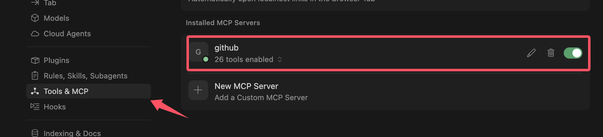

**MCP(Model Context Protocol)**的作用：AI本来无法读取我的数据库或连接我的github，通过配置`MCP`让它可以做到这些事



```json
//mcp.json
{
  "mcpServers": {
    "github": {
      "command": "npx",
      "args": ["-y", "@modelcontextprotocol/server-github"],
      "env": {
        "GITHUB_PERSONAL_ACCESS_TOKEN": "github的token"
      }
    }
  }
}
```

关于上面“github的token”，进入https://github.com/settings/tokens

点击 `Generate new token` -> `Generate new token (classic)`  

勾选`repo`，`read:org`，把生成的token替换进去